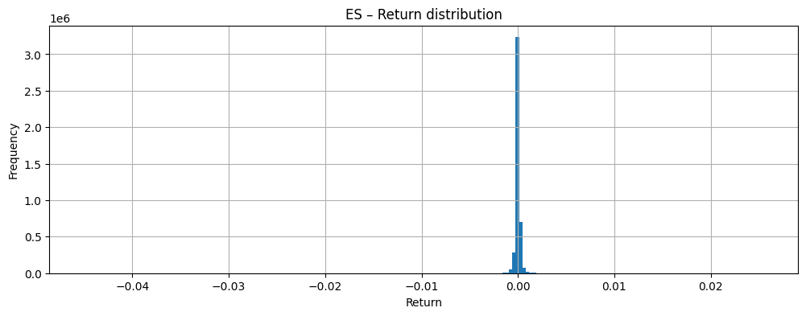
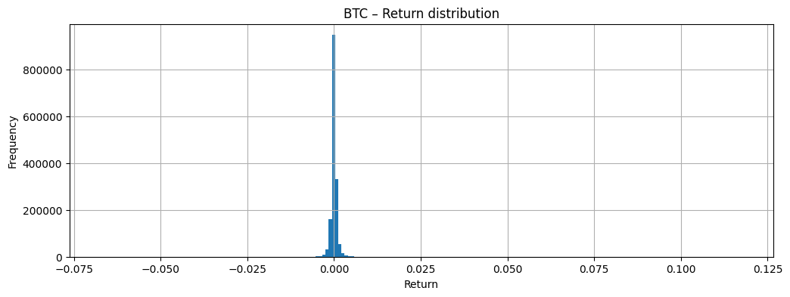
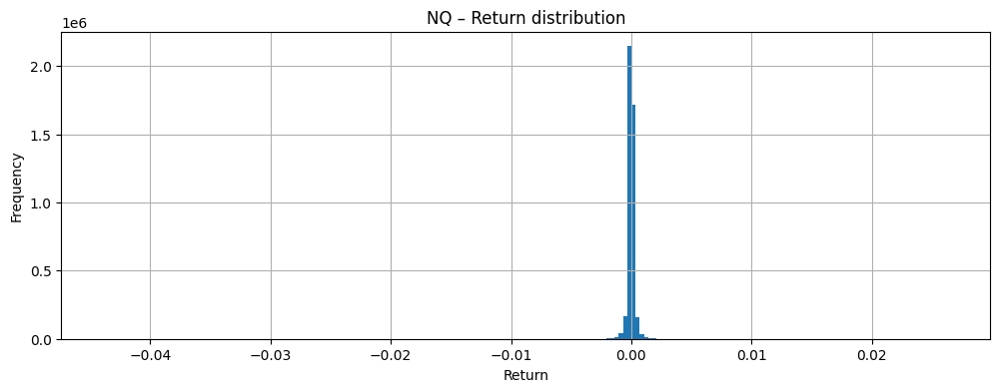
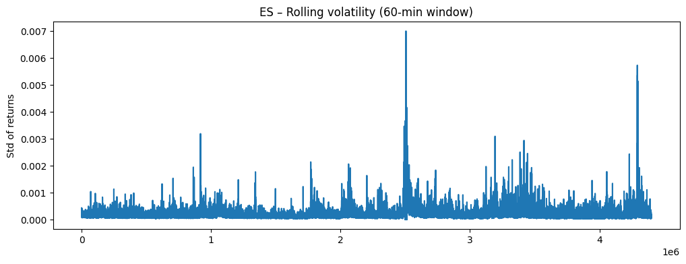
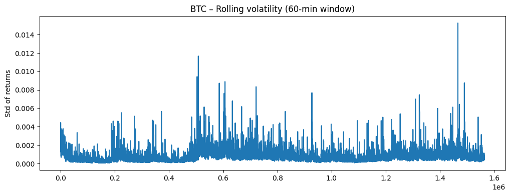
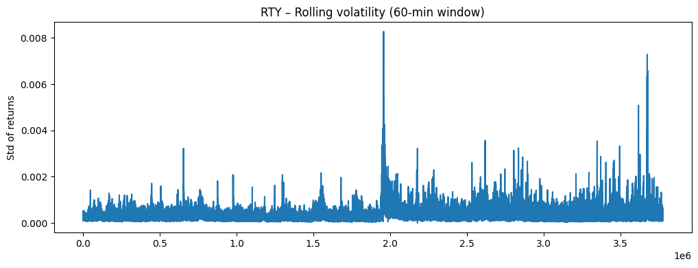
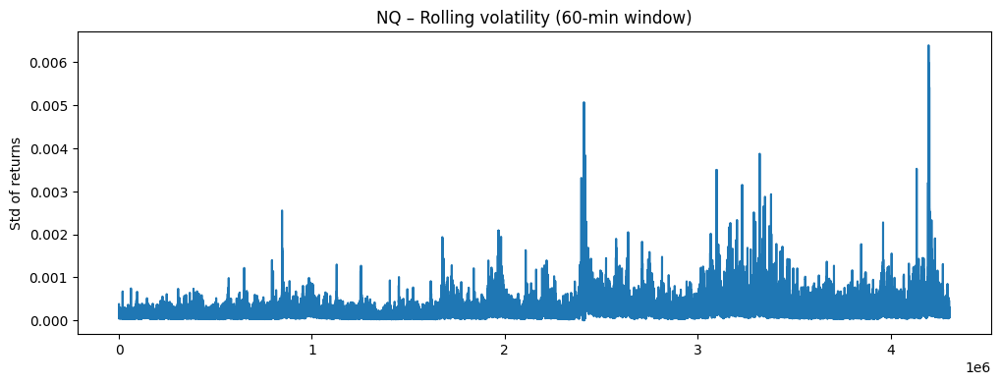
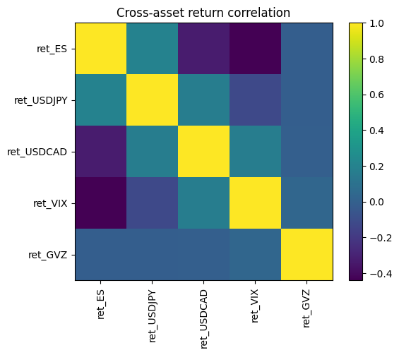
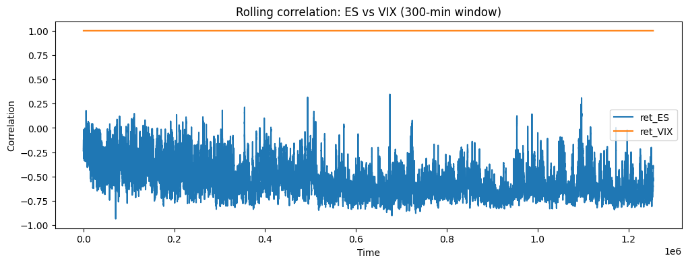
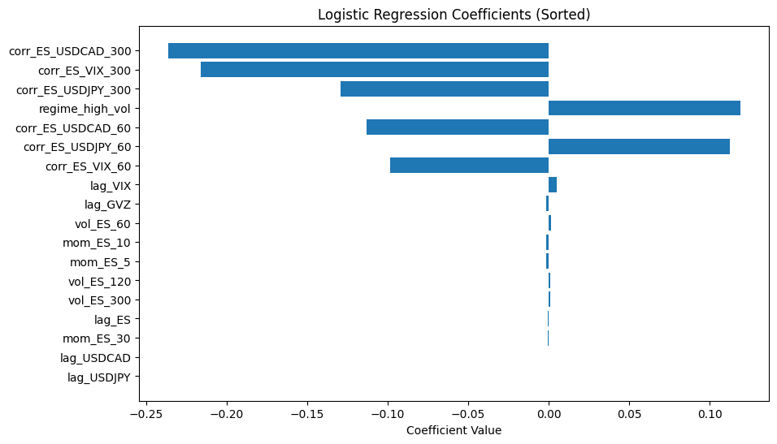

# Short-Horizon ES Direction Forecasting with Cross-Asset Features

**RWS ML Research Challenge**
**Author:** Laurentia Liennart

---

## Abstract

This project investigates whether the **30-minute ahead direction** of ES (S&P 500 E-mini Futures) can be predicted using minute-level financial features. I analyze return, volatility, and cross-asset structure, engineer multiple feature families, and evaluate a logistic regression classifier under strict time-respecting cross-validation.

Results show that:

* **Lagged returns alone** achieve ~0.564 accuracy
* **No feature set outperforms the majority baseline**
* Volatility, correlation, and momentum features do **not** improve predictability

This highlights the difficulty of short-horizon forecasting in liquid futures markets.

---

# 1. Introduction

Equity index futures like ES exhibit rapid mean reversion, noise, and short-lived autocorrelation, making directional prediction extremely challenging.

This study asks:

> **Can we predict whether ES will move up or down 30 minutes ahead using cross-asset information?**

I construct a unified dataset across ES, FX pairs (USDJPY, USDCAD), and volatility indices (VIX, GVZ), engineer predictive features, and benchmark a logistic regression model against simple baselines.

---

# 2. Data

## 2.1 Instruments and Sampling

* **ES** — S&P 500 E-mini futures
* **USDJPY**, **USDCAD** — FX
* **VIX**, **GVZ** — volatility indices

All data is sampled at **1-minute frequency**.

---

## 2.2 Return Distributions

**Figure 1 — ES return distribution**


**Figure 2 — BTC return distribution**


**Figure 3 — RTY return distribution**


**Figure 4 — NQ return distribution**


---

## 2.3 Rolling Volatility

**Figure 5 — ES rolling volatility (60-minute window)**


**Figure 6 — BTC rolling volatility**


**Figure 7 — RTY rolling volatility**


**Figure 8 — NQ rolling volatility**


---

# 3. Cross-Asset Structure

## 3.1 Static Correlation Structure

**Figure 9 — Cross-asset correlation matrix**


## 3.2 Time-Varying ES–VIX Correlation

**Figure 10 — Rolling correlation between ES and VIX (300-min window)**


---

# 4. Problem Formulation and Features

## 4.1 Target Label

Let **r_ES(t)** denote the per-minute ES return.
The **30-minute ahead return** is created by shifting ES returns backward:

```python
combined["target_ES_30m"] = combined["ret_ES"].shift(-30)
```

Binary label:

* **1** → return > 0 (ES goes up)
* **0** → return ≤ 0 (ES goes down or flat)

```python
combined["target_ES_30m_updown"] = (combined["target_ES_30m"] > 0).astype(int)
```

---

## 4.2 Feature Families

### **Lagged Returns**

* `lag_ES`, `lag_USDJPY`, `lag_USDCAD`, `lag_VIX`, `lag_GVZ`

### **Volatility**

* `vol_ES_60`, `vol_ES_120`, `vol_ES_300`
* Additional vol features for FX and volatility indices in full set

### **Cross-Asset Correlations**

* `corr_ES_VIX_60`, `corr_ES_VIX_300`
* `corr_ES_USDJPY_60`, `corr_ES_USDJPY_300`
* `corr_ES_USDCAD_60`, `corr_ES_USDCAD_300`

### **Momentum**

* `mom_ES_5`, `mom_ES_10`, `mom_ES_30`

### **Volatility Regime**

Binary flag based on top 30% of ES long-window volatility.

---

# 5. Experimental Setup

## 5.1 Model

A **logistic regression classifier** (`max_iter = 2000`) is used to evaluate predictive performance across feature groups.

## 5.2 Time-Respecting Cross-Validation

I use **TimeSeriesSplit (5 folds)** to avoid leakage:

* Training = past
* Testing = future
* Same folds for all feature groups
* Ensures realistic forecasting conditions

---

# 6. Baseline Performance

| Baseline          | Accuracy  |
| ----------------- | --------- |
| Random baseline   | 0.513     |
| Majority baseline | **0.564** |

Since the label is slightly imbalanced, the majority baseline is strong and difficult to beat.

---

# 7. Logistic Regression Results

## 7.1 Coefficient Analysis

**Figure 11 — Logistic regression coefficients (sorted)**


Interpretation:

* Long-window correlation features appear with large coefficients
* However, they do **not** translate into improved predictive power
* Lag features remain the only consistent contributors

---

# 8. Ablation Study

| Feature Group           | # Features | Mean Accuracy | Std Dev |
| ----------------------- | ---------: | ------------: | ------: |
| `lags_only`             |          5 |    **0.5641** |  0.0275 |
| `lags_plus_ES_vol`      |          8 |    **0.5641** |  0.0275 |
| `lags_ES_vol_plus_corr` |         14 |        0.5640 |  0.0276 |
| `full_features`         |         27 |        0.5639 |  0.0277 |

### Key Finding

* The **simplest model** (lag-only) performs best
* Volatility, correlation, and momentum features do **not** provide incremental signal
* Adding more features increases noise

---

# 9. Discussion

Short-horizon ES predictability is extremely limited.
Although ES exhibits economic relationships with FX and volatility markets, these do not translate into actionable predictive structure for 30-minute direction.

The fact that the logistic regression model — even with many engineered features — cannot outperform the majority baseline indicates that **the effective signal-to-noise ratio is near zero**.

---

# 10. Limitations

* Only ES and only a 30-minute horizon are studied
* No modeling of transaction costs or microstructure constraints
* Only logistic regression is evaluated (intentionally simple)
* Features are statistical, not order-book or high-frequency microstructure features

---

# 11. Future Work

* Explore shorter horizons (5–10 minutes)
* Add more macro futures (ZN, CL, GC) or sector indices
* Try nonlinear temporal models (LSTMs, TCNs, Transformers)
* Evaluate using log loss or Brier score instead of accuracy
* Consider volatility-regime–specific models

---

# 12. Repository Structure

```text
.
├── README.md
├── requirements.txt
├── notebooks/
│   └── RWS_Challenge.ipynb
├── src/
│   ├── data.py
│   ├── features.py
│   └── models.py
└── images/
    ├── es_return_dist.png
    ├── es_vol_60min.png
    ├── btc_return_dist.png
    ├── btc_vol_60min.png
    ├── rty_return_dist.png
    ├── rty_vol_60min.png
    ├── nq_return_dist.png
    ├── nq_vol_60min.png
    ├── cross_asset_corr_heatmap.png
    ├── es_vix_rolling_corr_300min.png
    └── logistic_coeffs_sorted.png
```

---

# 13. How to Run

### Google Colab

```python
DATA_DIR = "/content/drive/MyDrive/project_data"
```

Run all notebook cells.

### Local

```
pip install -r requirements.txt
```

Run with Jupyter or VS Code.

---
